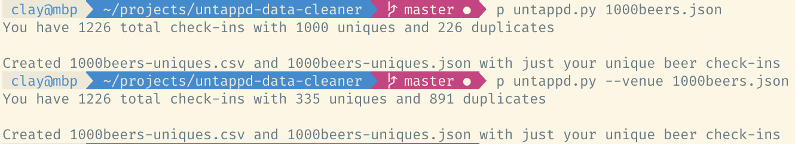

# untappd-data-cleaner

[Untappd](https://untappd.com/) allows you to download your checkin data in JSON and CSV formats (if you are a [supporter](https://untappd.com/supporter)). This is great, however they do not have an option to download the data of just your 'unique' checkins. This script will take the json file you downloaded from untappd and create both json and csv files with only your last checkins of each beer.

#### Why?
For unique beers, I have personally checked in my favorite beer over 50 times with a rating of 5 stars and this skews my overall average ratings if using the standard dataset from untappd. (On your profile they calculate average from uniques only)

For unique venues, I use the service Google MyMaps to create the [beer map](https://claydugo.com/beermap/) on my website and I've found it has a cap of 2000 rows for uploaded csv data. While I will have to revisit this issue once I reach 2000 venues, this solution is currently fine for the foreseeable future.

## Usage

###### To sort by unique beers  
Run `python3 untappd.py <UNTAPPD-DATA>.json`

###### To sort by unique venues  
Run `python3 untappd.py --venue <UNTAPPD-DATA>.json`

## License
MIT
