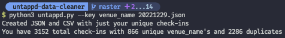

# untappd-data-cleaner

[Untappd](https://untappd.com/) allows you to download your checkin data in JSON and CSV formats (if you are a [supporter](https://untappd.com/supporter)). This is great, however they do not have an option to download the data of just your 'unique' checkins. This script will take the json file you downloaded from untappd and create both json and csv files with only your last checkins of each beer.

There are also additional parsing options detailed below. I use this to generate the [beer map](https://claydugo.com/beermap/) on my website. So this has become mostly tailored towards that.

## Usage

###### To sort by unique beers using their BeerID (bid)
Run `python3 untappd.py <UNTAPPD-DATA>.json`

###### To sort by a different key
List of keys:

`'brewery_name', 'venue_name', 'beer_type', 'photo_url'`

Adding additional keys will be trivial for you, but these made the most sense to include.

Run `python3 untappd.py <UNTAPPD-DATA>.json --key <key_name>`

##### Additional Flags

`--no_human_keys` will stop the key conversions

E.g. `venue_name -> Venue Name`

`--no_strip_backend` will keep all keys included in the json file

I current only keep the ones at the top of `untappd.py` by default.

`--no_fancy_data_format` will keep the `created_at` key in the `2022-01-01 23:59:59` format.

## License
MIT
